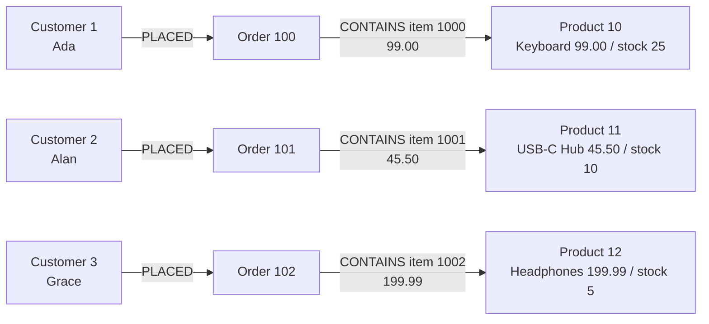
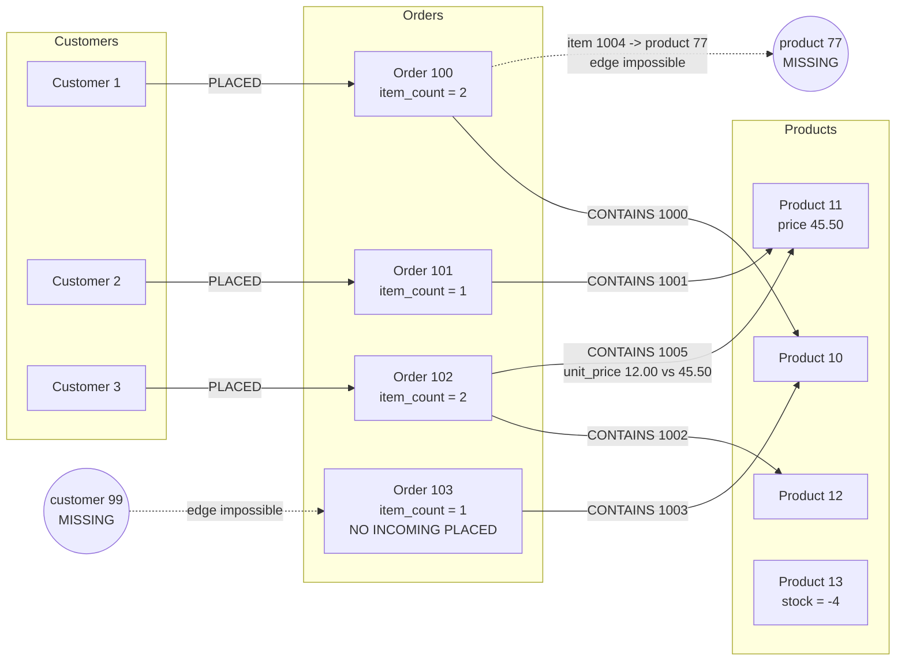
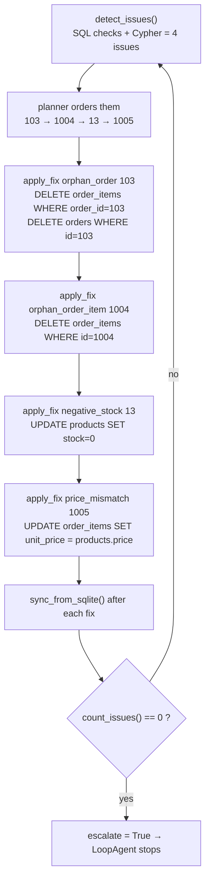
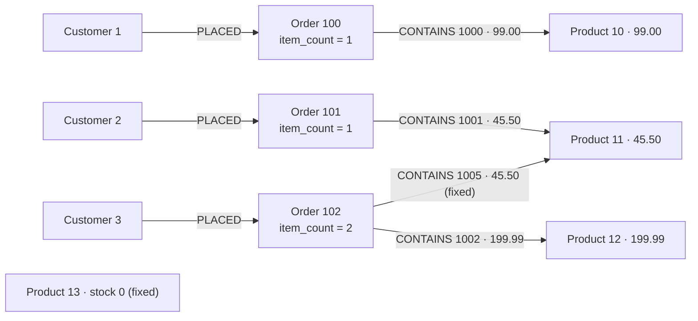

# Data walkthrough: clean → corrupted → graph → fixed

A row-by-row trace of what `db/seed_sqlite.py` writes, how the graph in
`graph/build_kuzu.py` reflects the damage, and what each fix does.

---

## 1. The clean dataset

**customers**

| id | name | email |
|---|---|---|
| 1 | Ada Lovelace | ada@example.com |
| 2 | Alan Turing | alan@example.com |
| 3 | Grace Hopper | grace@example.com |

**products**

| id | name | price | stock |
|---|---|---|---|
| 10 | Mechanical Keyboard | 99.00 | 25 |
| 11 | USB-C Hub | 45.50 | 10 |
| 12 | Noise Cancelling Headphones | 199.99 | 5 |

**orders**

| id | customer_id | order_date |
|---|---|---|
| 100 | 1 | 2024-01-05 |
| 101 | 2 | 2024-01-07 |
| 102 | 3 | 2024-02-11 |

**order_items**

| id | order_id | product_id | quantity | unit_price |
|---|---|---|---|---|
| 1000 | 100 | 10 | 1 | 99.00 |
| 1001 | 101 | 11 | 2 | 45.50 |
| 1002 | 102 | 12 | 1 | 199.99 |

Every foreign key resolves, every price matches the catalogue, stock is non-negative.



---

## 2. The four injected defects

The seed script then writes rows that violate the rules (SQLite's
`PRAGMA foreign_keys` is left off, exactly like a legacy system that lost its
constraints somewhere along the way).

| # | What is inserted | Rule broken |
|---|---|---|
| D1 | `orders(103, customer_id=99, '2024-03-01')` + its child `order_items(1003, 103, 10, 1, 99.00)` | customer 99 does not exist |
| D2 | `order_items(1004, order_id=100, product_id=77, 3, 19.99)` | product 77 does not exist |
| D3 | `products(13, 'Laptop Stand', 39.00, stock=-4)` | stock must be ≥ 0 |
| D4 | `order_items(1005, order_id=102, product_id=11, 1, unit_price=12.00)` | 12.00 ≠ catalogue price 45.50 |

Tables after corruption (new/changed rows marked ⚠):

**orders**

| id | customer_id | order_date | |
|---|---|---|---|
| 100 | 1 | 2024-01-05 | |
| 101 | 2 | 2024-01-07 | |
| 102 | 3 | 2024-02-11 | |
| 103 | **99** | 2024-03-01 | ⚠ D1 — no such customer |

**products**

| id | name | price | stock | |
|---|---|---|---|---|
| 10 | Mechanical Keyboard | 99.00 | 25 | |
| 11 | USB-C Hub | 45.50 | 10 | |
| 12 | Noise Cancelling Headphones | 199.99 | 5 | |
| 13 | Laptop Stand | 39.00 | **-4** | ⚠ D3 |

**order_items**

| id | order_id | product_id | quantity | unit_price | |
|---|---|---|---|---|---|
| 1000 | 100 | 10 | 1 | 99.00 | |
| 1001 | 101 | 11 | 2 | 45.50 | |
| 1002 | 102 | 12 | 1 | 199.99 | |
| 1003 | 103 | 10 | 1 | 99.00 | child of the orphan order (D1) |
| 1004 | 100 | **77** | 3 | 19.99 | ⚠ D2 — no such product |
| 1005 | 102 | 11 | 1 | **12.00** | ⚠ D4 — should be 45.50 |

---

## 3. How the graph exposes the damage

`sync_from_sqlite()` copies rows into nodes, but creates an edge **only when both
endpoints exist**. So a broken foreign key literally cannot be drawn — the defect
becomes a *missing edge*, which Cypher finds in one line.



What each defect looks like in the graph, and the query that catches it:

| Defect | Graph symptom | Cypher |
|---|---|---|
| D1 orphan order | `Order 103` has no incoming `PLACED` | ``MATCH (o:`Order`) WHERE NOT EXISTS { MATCH (:Customer)-[:PLACED]->(o) } RETURN o.id`` |
| D2 orphan item | `Order 100` has `item_count = 2` but only **1** `CONTAINS` edge | ``MATCH (o:`Order`) OPTIONAL MATCH (o)-[c:CONTAINS]->(:Product) WITH o, count(c) AS linked WHERE linked < o.item_count RETURN o.id`` |
| D3 negative stock | node property out of range | `MATCH (p:Product) WHERE p.stock < 0 RETURN p.id, p.stock` |
| D4 price mismatch | edge property ≠ node property | ``MATCH (:`Order`)-[c:CONTAINS]->(p:Product) WHERE abs(c.unit_price - p.price) > 0.001 RETURN c.item_id`` |

`item_count` is the trick that makes D2 visible: the number of `order_items` SQLite
has for that order is copied onto the node, so "fewer edges than items" = dangling rows.

---

## 4. The repair, step by step

The planner orders the work (orphan orders first, because deleting an order also
deletes its children and can make later issues vanish), then the fixer calls
`apply_fix` once per step. After **every** fix the graph is rebuilt, so the next
detection pass reasons about repaired data.



Row-level before / after (exactly what the run prints):

| Fix | Before | After |
|---|---|---|
| `orphan_order:103` | `orders(103, 99, 2024-03-01)` + `order_items(1003, 103, 10, 1, 99.00)` | rows deleted |
| `orphan_order_item:1004` | `order_items(1004, 100, 77, 3, 19.99)` | row deleted |
| `negative_stock:13` | `products(13, 'Laptop Stand', 39.00, stock=-4)` | `stock = 0` |
| `price_mismatch:1005` | `order_items(1005, 102, 11, 1, unit_price=12.00)` | `unit_price = 45.50` |

Issue count over the pass: **4 → 3 → 2 → 1 → 0**.

---

## 5. The repaired graph

Every node that should have an edge now has one; every edge property agrees with
its node.



Final SQL verification printed by `main.py`:

```
orphan orders        0
orphan order_items   0
negative stock       0
price mismatches     0
TOTAL REMAINING DEFECTS: 0
```
